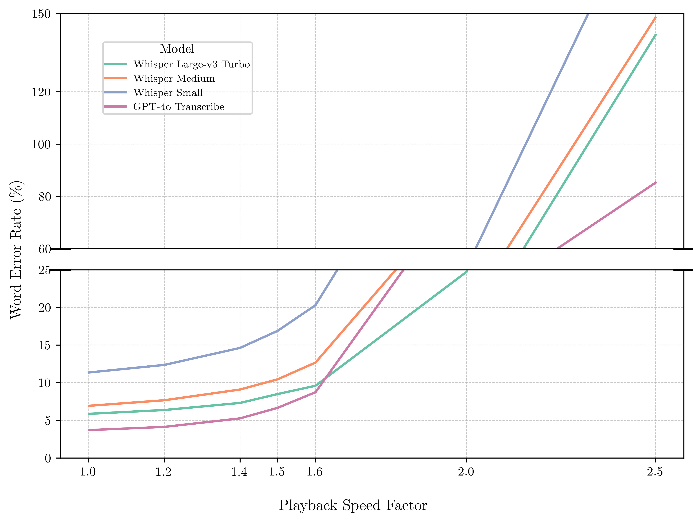
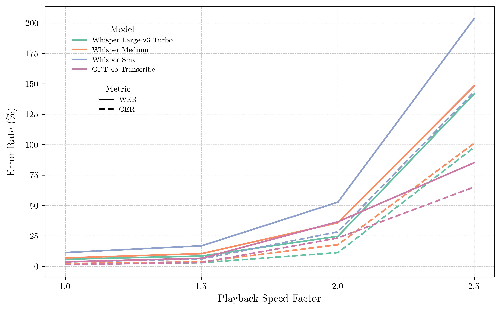
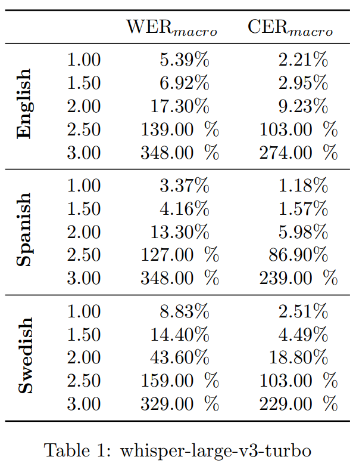
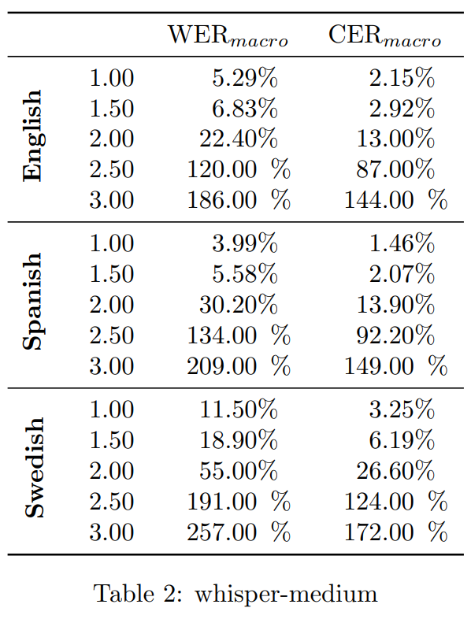
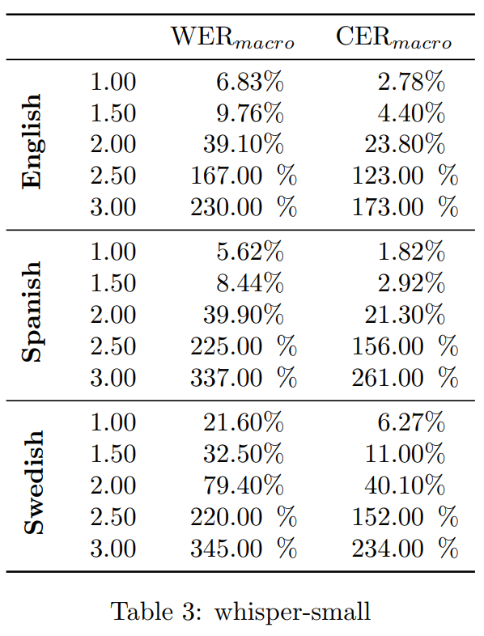
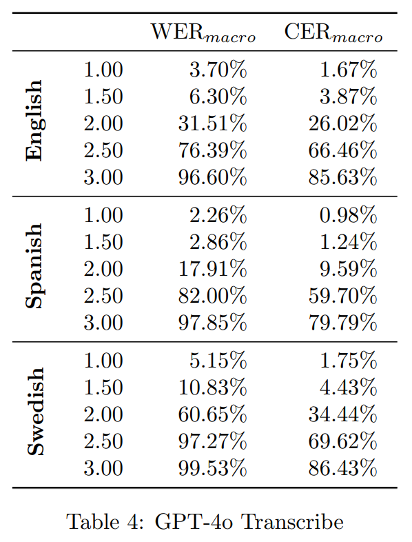
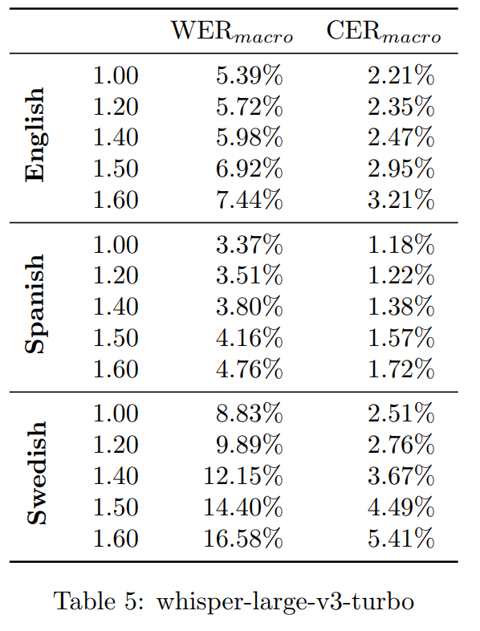
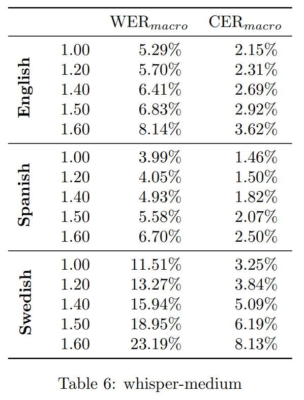
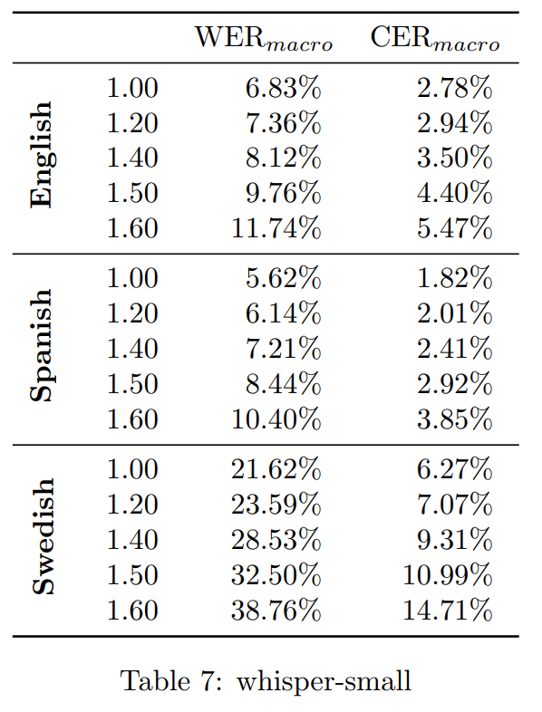
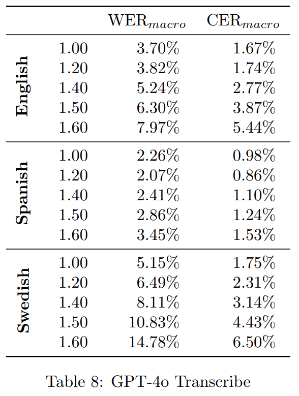

# Does audio speedup affect speech recognition?
*yes, obviously. but to what extent?*

Over the weekend I stumbled upon a post on x that lead me to this article: [*OpenAI Charges by the Minute, So Make the Minutes Shorter*](https://george.mand.is/2025/06/openai-charges-by-the-minute-so-make-the-minutes-shorter/) which shows how speeding up a youtube audio before transcription leads lower api costs with minimal performance degradation. Naturally I thought this sounded too good to be true, free lunch? The author was clear in saying that he had not benchmarked this claim, and that it was mostly passed on a few samples passing the eye test, so what follows is a more rigorous evaluation of this possibility.

Here, we assess how audio speedup affects the performance of state-of-the-art speech-to-text models. By benchmarking top-tier models like OpenAI's Whisper and GPT-4o against audio accelerated by various speed factors, we aim to measure model robustness and define practical performance limits for high-speed transcription tasks.

Leveraging the FLEURS dataset as a controlled evaluation benchmark, the analysis systematically measures transcription accuracy degradation using standard metrics—primarily macroWord Error Rate (WER).

### TL;DR

Unfortunately, the results show that transcription accuracy doesn't degrade gracefully. Instead, it deteriorates exponentially with increased speed, especially beyond 1.5x, where performance quickly falls off a cliff.

<p align="center">
  
</p>

<p align="center">
  <em>The word error rate across three languages in the FLEURS test set, at increasing speedup factors. Error rates are averaged across language.</em>
</p>

## Experiment

### Coarse
Experiments targeted the Whisper-model family (small, medium, and large-v3-turbo) and GPT-4o Transcribe, using the multilingual FLEURS test sets (English, Spanish, and Swedish). Transcription accuracy was assessed using Word Error Rate (WER) and Character Error Rate (CER), computed via [jiwer](https://github.com/jitsi/jiwer). Tested speedup factors included: 1.0, 1.5, 2.0, 2.5, and 3.0.

Results summary:

<p align="center">
  
</p>

---

Detailed per-model results:
<p align="center">
  
  
  
  
</p>

### Finer resolution
Given the observed exponential increase in WER beyond a specific threshold, further evaluations were conducted with finer granularity between 1.0 and 1.6 speedup factors. Conditions and evaluation protocols remained consistent with initial tests.


<p align="center">
  
</p>

---

Detailed per-model results:
<p align="center">
  
  
  
  
</p>

Performance degradation exhibits clear exponential characteristics. Models experience a pronounced "accuracy cliff" around the 1.2x–1.3x speedup region. This behavior implies a critical acoustic distortion threshold, beyond which models fail to maintain effective feature extraction and recognition performance.

### words per minute 

Currently, the study uniformly applies speedup factors to audio samples, without explicitly controlling or measuring Words per Minute (WPM). However, speaker-dependent variability in baseline WPM could significantly influence model robustness to speed-induced artifacts. I'm considering
decoupling speed-up factors from samples and instead plotting performance against raw WPM. 

## Recreating the results

### 1. Set up the environment

This project uses `uv` for package management.

```bash
# install python dependencies
uv sync
```

### 2. Download and preprocess the data

We use the [FLEURS dataset](https://huggingface.co/datasets/google/fleurs) for evaluation. The `download_dataset.py` script will download the necessary splits.

```bash
uv run scripts/download_dataset.py
```

This will download the data to `data/fleurs`.

Next, we need to preprocess the data to create the sped-up versions.

```bash
uv run scripts/preprocess_fleurs.py
```

This script takes the downloaded FLEURS splits from `data/fleurs` and creates a new version at `data/fleurs_preprocessed`. This new version contains multiple copies of each utterance, sped up by factors of 1.0, 1.5, 2.0, 2.5, and 3.0.

### 3. Run the evaluation

The `src/evaluate_fleurs.py` script runs the evaluation. It takes two main arguments: `--interface` and `--model-id`.

The interface determines how to run the model:

*   `whisper_transformers`: Uses the Hugging Face `transformers` library. This is the easiest way to run open-weight Whisper models.
*   `whisper_cpp`: Uses a local `whisper.cpp` server. This is faster for CPU inference.
*   `openai`: Uses the OpenAI API for closed-source models like `whisper-large-v3`.

The `model-id` specifies the model to use, e.g., `openai/whisper-large-v3`.

Here are some example commands:

```bash
# Evaluate Whisper large-v3 using the transformers library
uv run src/evaluate_fleurs.py --interface whisper_transformers --model-id openai/whisper-large-v3

# Evaluate Whisper medium using whisper.cpp
# (make sure the whisper.cpp server is running first)
uv run src/evaluate_fleurs.py --interface whisper_cpp --model-id large-v3

# Evaluate OpenAI's API-based Whisper
uv run src/evaluate_fleurs.py --interface openai --model-id whisper-1
```

The results will be saved as CSV files in the `results/` directory.

## Caveats

*   **Speed-up method**: The audio is sped up using `torchaudio.sox_effects` with the `tempo` effect. This method preserves pitch, but may introduce artifacts that are not representative of natural fast speech.
*   **Dataset**: I have only tested on the test set of FLEURS.
*   **Languages**: The evaluation is currently run on English, Spanish, and Swedish.
*   **Normalization**: The reference and hypothesis texts are normalized before calculating WER/CER. The normalization includes lowercasing, removing punctuation, and removing Kaldi non-words. This is a standard practice, but it can hide certain types of errors.